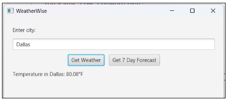
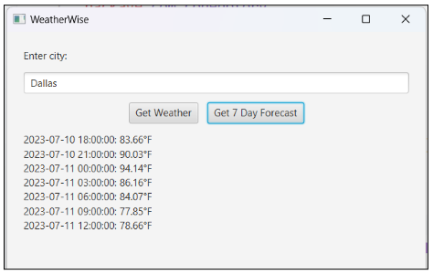
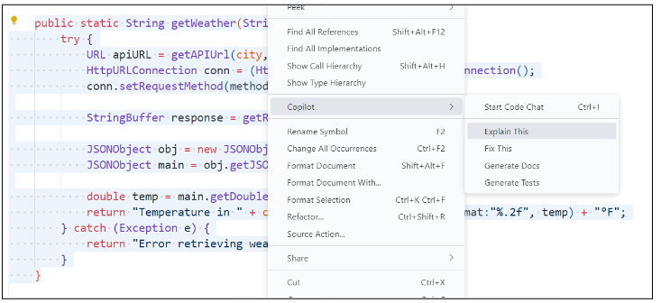

# WeatherWise App

Currently, the WeatherWise app allows users to retrieve real-time temperature data for any city.

But there's one problem – users want to view the 7-day forecast for a specified city.

Before implementing the logic for your app:

1. Take a moment to review the README to understand the code that is provided and tasks that need to be completed.
2. Decide with your partner which tasks each of you will complete on your individual branches. As you work, remember to commit your code after completing a task!

## Step 1: Understanding the Code

Before we start modifying this code, we should first make sure we understand what it currently does. Take a moment to read through the code. For any parts that you're unsure of, highlight the code and right-click, then choose **Copilot > Explain This**.

Copilot will generate an explanation of the code you highlighted in the chat panel. Be sure also to ask follow-up questions if you need additional clarification on the code.

## Step 2: Breaking Down the Problem

AI code-generators like Copilot are most effective when the task you want them to do is clear and specific. Before asking Copilot what code you need to solve this problem, outline the steps the program needs to take to implement the desired functionality.

Remember, the user wants to see the forecast for the next seven days for a specified city when they click the **Get 7 Day Forecast** button.

✅ **Do This:** With your partner, plan the steps the app needs to take. This can be in the form of pseudocode, a flowchart, sketches, or any other representation you choose.

Write your plan here!

## Step 3: Planning the Prompt

✅ **Do This:** Based on the steps you've outlined, what code do we need to ask Copilot for? With your partner, plan the prompt you want to ask Copilot.

Write your prompt here!

> &nbsp;
> **Tip!**
>
> Try starting your prompt with `"Modify the getWeekForecast() method to"` followed by the steps that need to be added to this method.
> &nbsp;

## Step 4: Evaluating the Code

AI code-generating tools like Copilot are not always right and sometimes even suggest code that is redundant or inefficient. Before adding its suggestion to the program, let's check if it makes sense and aligns with what we're expecting.

✅ **Do This:** With your partner, trace the code Copilot suggested as a solution. This can be in the form of a numbered or bulleted list, a flowchart, a drawing, or any other representation you choose.

Trace your code here!

Based on your analysis, would the code it suggested make sense as a solution to the problem? Why or why not?

Write your response here!

If the code it suggested does **not** make sense as a solution, what needs to be improved - the steps you outlined to solve the problem or the prompt you gave Copilot? What modifications do you need to make?

Write your response here!

**🔁 Repeat this process until you feel confident you have a working solution!**

## Step 5: Testing the Code

So the code it gave makes sense . . . now what?? Well, let's add it to our program and see if it works!

**Partner A & Partner B:** After implementing your solution, submit a pull request to merge your branches to the main branch. Partner A should then review Partner B's pull request, while Partner B should then review Partner A's pull request.

1. **Partner B:** Navigate to the repo on GitHub and go to the Pull requests tab. Click the New pull request button to start a pull request.
2. **Partner B:** Provide a title and brief description, and select Partner A as the reviewer.
3. **Partner A:** Navigate to the repo on GitHub and go to the Pull requests tab. Click the New pull request button to start a pull request to merge your branch to main.
4. **Partner A:** Provide a title and brief description, and select Partner B as the reviewer.

### Reviewing the PR

1. Go to the **Pull Requests** tab and select your partner's pull request from the list.
2. Click the **Files Changed** tab and go through the changes line by line. For each change, you can click on the line number to add a comment about the line.
3. When you're done reviewing, write a summary comment to give overall feedback about the changes.
   * If changes are needed, be sure to specify what changes your partner needs to make and select **Request changes** to send it back for updates.
   * If everything looks good, select **Approve**. On the **Conversation** tab, click the green button to merge the pull request. Click the **Delete branch** button after the merge is complete.

✅ **Do This:** Update the `AppLogic` class with the code that needs to be added to implement the desired functionality.

Switch to the `main` branch after merging both branches, and test the app (run `App.java`)! Enter a city, then click the **Get 7 Day Forecast** button to view the results. Did it work? Why or why not?

Write your response here!

If the app does **not** work as expected, what is it doing or **not** doing?

Write your response here!

**🔁 If the app doesn't work as expected, follow the process you used in Steps 2 through 5 to break down the problem, plan the prompt to ask Copilot, evaluate the code it suggests, and implement and test its suggestion.**
